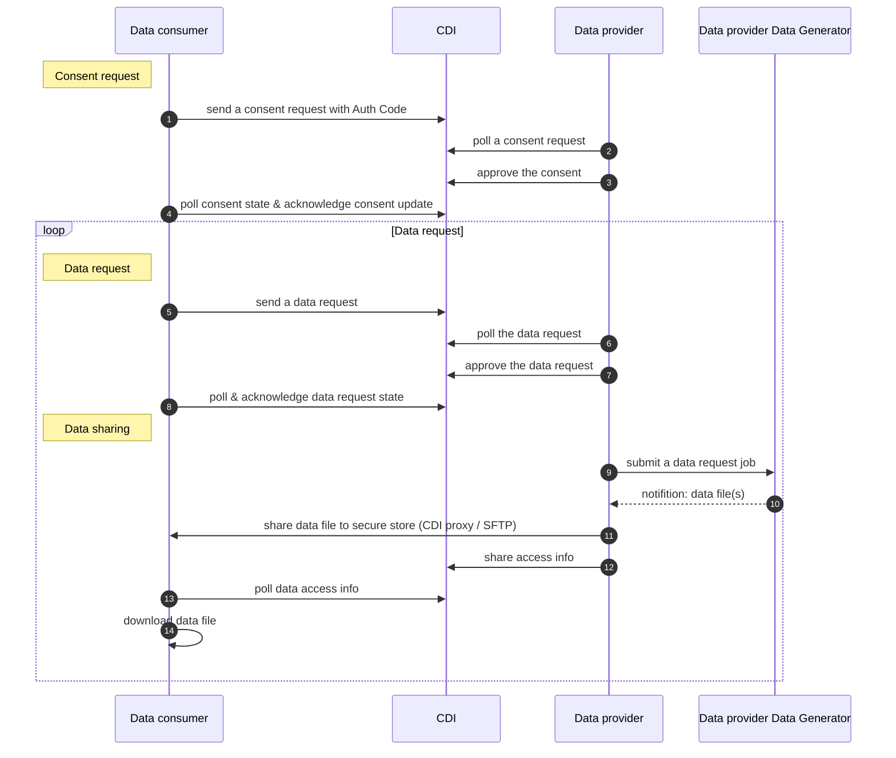

# CDI Integration

## Overview of the QFPay's CDI data consent & request flow



## Auth Code

The authorization code (Auth Code) has been adapted to the data owner's authorization of data sharing consent and identification. 

Auth Code can be retrieved in QFPay merchant portal (MMS) anytime. It enables data owners to commit their consent confirmation online, to benefit from the full digital wordflow over the CDI and flexibility of Data Consent without a traditional phone call, or identification document check.

Data Consumer can submit the Auth Code via Consent request payload as below

```json
{
  "public": {
    ...
  },
  "private": {
    "dataOwnerId": "DO_001",
    "purposePrivate": "JNS76EAJ", <--- Auth Code
    "consentFileList": [
      ...
    ]
  }
}
```

### Retrieve Auth Code

refer the [Steps to get Auth Code](!https://cdn.qfpay.com.hk/user_guide/Auth%20Code%20user%20guide.pdf)

## Data access info - SFTP

### Prerequisite

- a SSH public key has been add to SFTP server
- a SFTP user has been created

### access info example

```json
{
  "channel": "SFTP",
  "endPoint": "${SFTP_HOSTNAME}:${SFTP_PORT}",
  "accessToken": "SFTP_PRIVATE_KEY_NAME",
  "fileType": "csv",
  "filePath": "${uploadAbsoluteRemotePath}/${consumerId}/upload/TXN-V02-1130000459-20220401-20230309-1678327514554.csv",
  "fileHash": "$fileHash"
}

```

### last file indicator

To indicate no futher updates for data files

```json
{
    "channel": "SFTP",
    "endPoint": "${SFTP_HOSTNAME}:${SFTP_PORT}",
    "accessToken": "SFTP_PRIVATE_KEY_NAME",
    "fileType": "csv",
    "filePath": "/upload/completed.csv",
    "fileHash": "$fileHash"
  }
```

## Data access info - CDI Proxy

### access info example

```json
{
  "channel": "HTTPS",
  "accessToken": "http_basic_authentication_password",
  "fileType": "csv",
  "endpointReverseProxy": " https://proxy-dataprovider-preprod.cdi.network/75f45deba96ff1b262b63180cb183ba4/OFPAYHFL1004DP/main data/ACCT12345 /data file 001.csv",
  "fileHash": "$fileHash",
  ...
}

```

## Error codes

| rejectReasonCode 	| rejectReasonDetail [^1] & description 	|
|---	|---	|
| DataRequestRejectReasonInvalidConsent 	| INVALID_CONSENT 	|
| DataRequestRejectReasonInvalidScope 	| INVALID_DATE_RANGE 	|
| DataRequestRejectReasonCustomerNotFound 	| CUSTOMER_NOT_FOUND 	|
| DataRequestRejectReasonInvalidHashKeyOfRequestPrivate 	| FILE_CHECKSUM_FAILED 	|
| DataRequestRejectReasonInvalidPurpose 	| INVALID_PURPOSE_VALUE 	|
| DataRequestRejectReasonOthers 	| [^NO_DATA] - No data found from the data request scope OTHER_REASON 	|
|  	|  	|
| ConsentRejectReasonInvalidSignature 	| INVALID_SIGNATURE 	|
| ConsentRejectReasonInvalidExpireTime 	| INVALID_EXPIRE_TIME 	|
| ConsentRejectReasonInvalidScope 	| INVALID_DATE_RANGE 	|
| ConsentRejectReasonCustomerNotFound 	| CUSTOMER_NOT_FOUND 	|
| ConsentRejectReasonInvalidHashKey 	| FILE_CHECKSUM_FAILED 	|
| ConsentRejectReasonInvalidPurpose 	| INVALID_PURPOSE_VALUE 	|
| ConsentRejectReasonOthers 	| OTHER_REASON<br>INFO_MISMATCH - BR/CI & Company name not match<br>BR_NOT_FOUND<br>CI_NOT_FOUND<br>INVALID_INFO - some data is invalid / auth code is invalid<br>MISSING_INFO - some data is missing 	|


[^1] example of explicit value in rejectReasonDetail:

[^NO_DATA] No data found from the data request scope

## Test values

| ENV  | Merchant Name Eng | Merchant Name Chi | BrNo     | CI       | MID      | QF merchant Auth Code | Simulation             | 
|------|-------------------|-------------------|----------|----------|----------|-----------------------|------------------------|
| test | Merchant One      | 一號商户              | 10000001 | 12000001 | 11000001 | 11000001            | normal                 |
| test | Merchant Two      | 商户二               | 10000002 | 12000002 | 11000002 | 11000002             | big data file (<20MB)  | 
| test | Merchant Three    | 商户三               | 10000003 | 12000003 | 11000003 | 11000003             | normal                 |
| test | Merchant Four     | 商户四               | 10000004 | 12000004 | 11000004 | 11000004             | normal                 |
| test | Merchant Five     | 商户五               | 10000005 | 12000005 | 11000005 | 11000005             | big data file (<20MB)  |
| test | Merchant Six      | 商户六               | 10000006 | 12000006 | 11000006 | 11000006             | large data file (>20MB)|
| test | Merchant Seven    | 商户七               | 10000007 | 12000007 | 11000007 | 11000007             | large data file (>20MB)|
| test | Merchant Eight    | 商户八               | 10000008 | 12000008 | 11000008 | 11000008             | empty data file       |
| test | Merchant Nine     | 商户九               | 10000009 | 12000009 | 11000009 | 11000009             | empty data file       |
